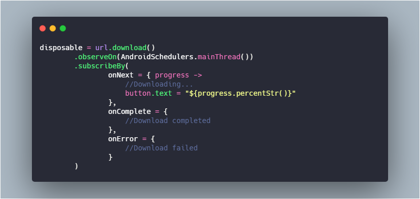

# RxDownload

 

[](https://jitpack.io/#ssseasonnn/RxDownload)

A multi-threaded download tool written with RxJava and Kotlin

*Read this in other languages: [中文](README.ch.md), [English](README.md), [Changelog](CHANGELOG.md)* 

## Prepare

- Add jitpack repo:

    ```gradle
    maven { url 'https://jitpack.io' }
    
- Add RxDownload dependency:

    ```gradle
    //Load on demand
    implementation "com.github.ssseasonnn.RxDownload:rxdownload4:1.1.4"
    implementation "com.github.ssseasonnn.RxDownload:rxdownload4-manager:1.1.4"
    implementation "com.github.ssseasonnn.RxDownload:rxdownload4-notification:1.1.4"
    implementation "com.github.ssseasonnn.RxDownload:rxdownload4-recorder:1.1.4"
    
    or: 
    //Add all dependencies of RxDownload4
    implementation "com.github.ssseasonnn:RxDownload:1.1.4"
    ```

## Basic Usage

- Start download:

    ```kotlin
    disposable = url.download()
            .observeOn(AndroidSchedulers.mainThread())
            .subscribeBy(
                    onNext = { progress ->
                        //download progress
                        button.text = "${progress.downloadSizeStr()}/${progress.totalSizeStr()}"
                        button.setProgress(progress)
                    },
                    onComplete = {
                        //download complete
                        button.text = "Open"
                    },
                    onError = {
                        //download failed
                        button.text = "Retry"
                    }
            )    
    ```

- Stop download:

    ```kotlin
    disposable.dispose()    
    ```
    
- Get download file:

    ```kotlin
    val file = url.file()
    // or
    val file = task.file() 
    // use file...   
    ```
    
- Delete download files:

    ```kotlin
    url.delete()
    // or
    task.delete() 
    ```

## Task Manager

- Get a TaskManager object:

    ```kotlin
    val taskManager = url.manager()
    ```
    
- Subscribe to status update:

    ```kotlin
   //keep this tag for dispose
   val tag = taskManager.subscribe { status ->
        // Receive download status
        when (status) {
            is Normal -> {}
            is Started -> {}
            is Downloading -> {}
            is Paused -> {}
            is Completed -> {}
            is Failed -> {}
            is Deleted -> {}
        }
    }
        
    ``` 
    
    > **progress** can be obtained from **status**, when status is **Failed**, 
    you can get **throwable** from it, which is the reason for the failure.
    
- Cancel status update subscription:

    ```kotlin
    //dispose tag
    taskManager.dispose(tag)
    ```
    
- Start download:

    ```kotlin
    taskManager.start()
    ```

- Stop download:

    ```kotlin
    taskManager.stop()
    ```
    
- Delete download:

    ```kotlin
    taskManager.delete()
    ```

- Get download file:

    ```kotlin
    val file = taskManager.file() 
    // use file...   
    ```
    
## Task Recorder

- Query single task:

    ```kotlin
     // Query task with url
     RxDownloadRecorder.getTask("url")
           .observeOn(AndroidSchedulers.mainThread())
           .subscribeBy { TaskEntity ->
               // TaskEntity                        
           } 
    ``` 
    
- Query a batch of tasks:

    ```kotlin
     // Query task with urls
     RxDownloadRecorder.getTaskList("url1","url2","url3")
           .observeOn(AndroidSchedulers.mainThread())
           .subscribeBy { list ->
               // list of TaskEntity                        
           } 
    ```    
    
- Get a list of all downloads:

    ```kotlin
     RxDownloadRecorder.getAllTask()
           .observeOn(AndroidSchedulers.mainThread())
           .subscribeBy { list ->
               //list of TaskEntity                        
           }
    ```
    
- Query all download records for a state:

    ```kotlin
     // Query all Completed records
     RxDownloadRecorder.getAllTaskWithStatus(Completed())
           .observeOn(AndroidSchedulers.mainThread())
           .subscribeBy { list ->
               //list of TaskEntity                        
           } 
    ``` 
    
- Paging query download record list:

    ```kotlin
     RxDownloadRecorder.getTaskList(page, pageSize)
           .observeOn(AndroidSchedulers.mainThread())
           .subscribeBy { list ->
               //list of TaskEntity                        
           }
    ```
    
- Paging query list of download records in a certain state:

    ```kotlin
     // Get the list of pages that have been Completed
     RxDownloadRecorder.getTaskListWithStatus(Completed(), page, pageSize)
           .observeOn(AndroidSchedulers.mainThread())
           .subscribeBy { list ->
               //list of TaskEntity                        
           }
    ```

    > **TaskEntity** has a **abnormalExit** field, 
    which is used to indicate whether the Task has paused by the APP forced close.

- Start All:

    ```kotlin
     RxDownloadRecorder.startAll()
    ```
    
- Stop All:

    ```kotlin
     RxDownloadRecorder.stopAll()
    ```
    
- Delete All:

    ```kotlin
     RxDownloadRecorder.deleteAll()
    ```

## License

> ```
> Copyright 2019 Season.Zlc
>
> Licensed under the Apache License, Version 2.0 (the "License");
> you may not use this file except in compliance with the License.
> You may obtain a copy of the License at
>
>    http://www.apache.org/licenses/LICENSE-2.0
>
> Unless required by applicable law or agreed to in writing, software
> distributed under the License is distributed on an "AS IS" BASIS,
> WITHOUT WARRANTIES OR CONDITIONS OF ANY KIND, either express or implied.
> See the License for the specific language governing permissions and
> limitations under the License.
> ```
